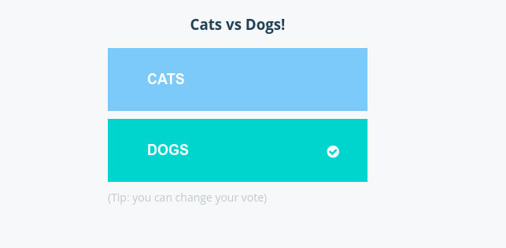
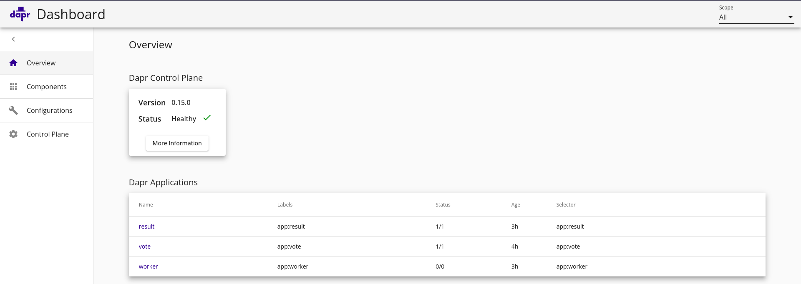
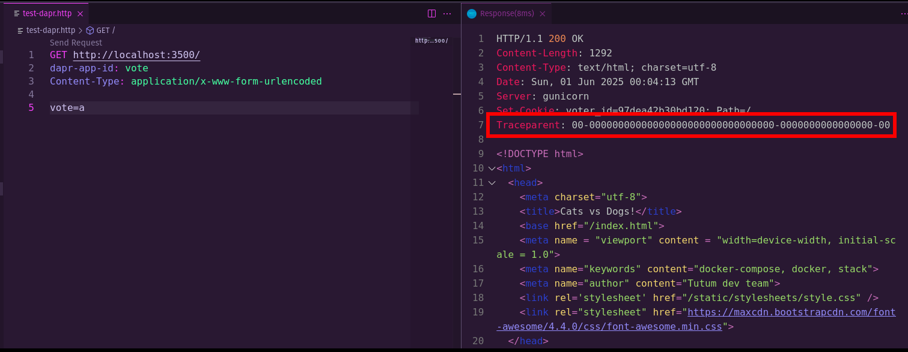
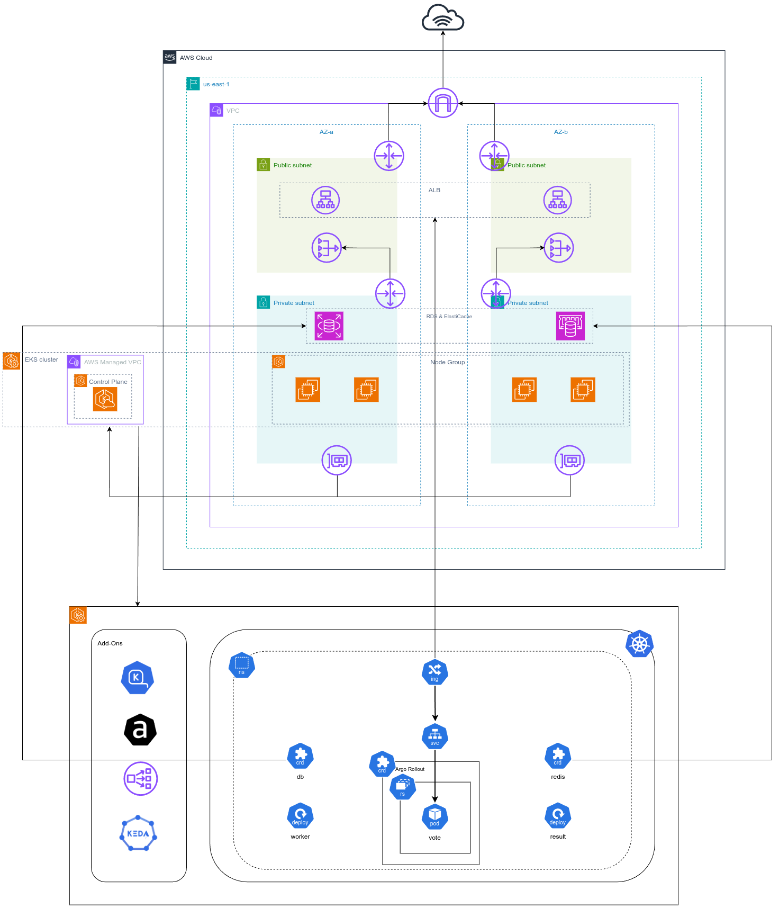
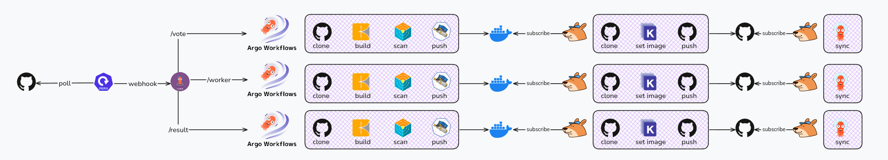
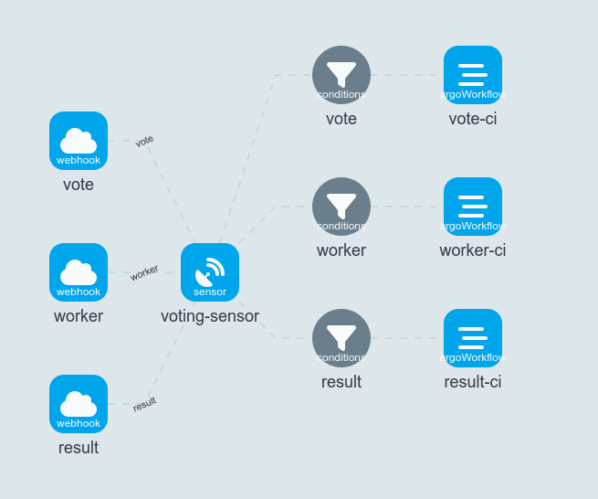
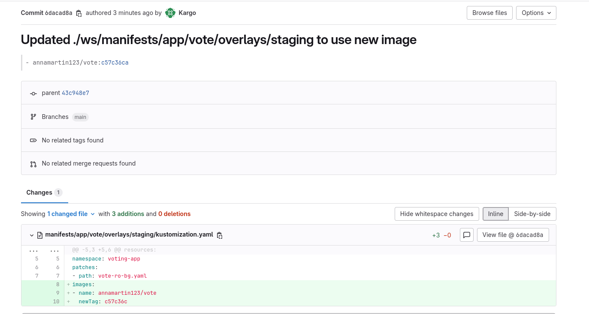
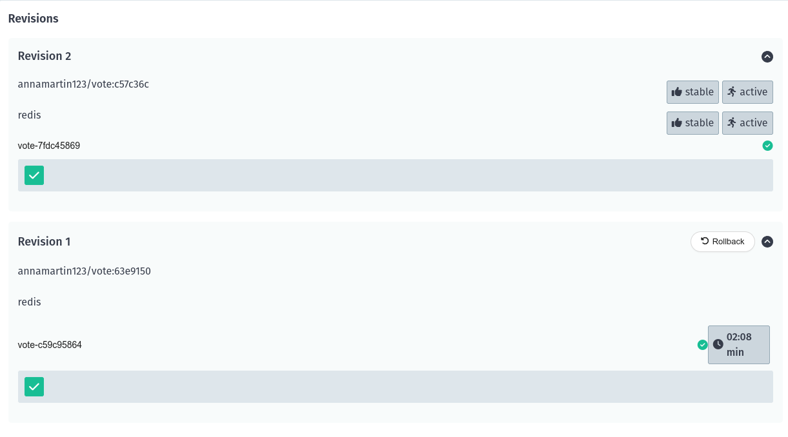
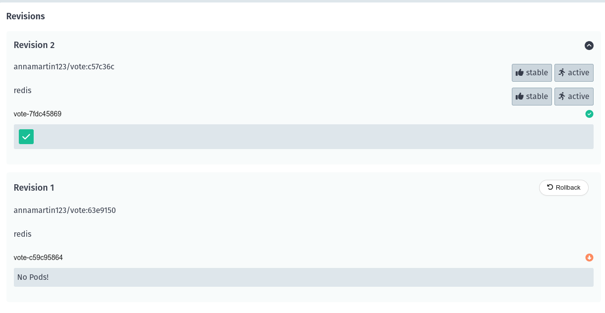
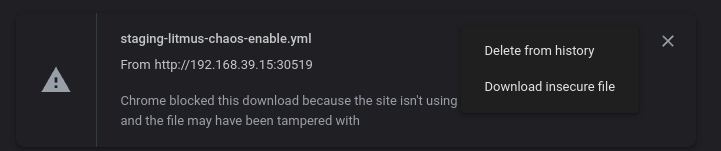

# About the Project



YAVA (yet another voting app) is a project base on the famous [docker voting app](https://github.com/dockersamples/example-voting-app), The aim of the project is to create a full deployment pipeline to deploy the app through staging and production using best practices and cutting edge technologies.
The project is highly based on using the argo suite tools, Some of the tools used in this project are:

CI: `argo workflow`

CD (GitOps): `argocd`

progressive delivery: `argo rollout`

event-driven automation: `argo events`

Multi-Stage GitOps Continuous Promotion: `kargo`

Autoscalers: `keda` + `karpenter`

Secrets: `bitnami sealed secrets`

Chaos enginnering: `litmus chaos`

image scanning: `trivy`

troubleshooting: `inspektor gadget`

Infrastructure:

    control plane as a service: `kamaji` + `capi` 

    virtualization: `kubevirt`

    IaC: `crossplane` + `ack`

    cloud provider: `aws`

    local testing: `localstack`

development: `eclipse che (openshift devspace)`

The project consists of a management cluster created by `minikube` using the upstream version of kubernetes, a staging cluster created by `kamaji` which also uses the upstream version of kubernetes, a production cluster using `eks` in aws


# About the app


- the app is the [docker voting app](https://github.com/dockersamples/example-voting-app), the app consists of 3 microservices (vote, result, worker), a postgres db and redis.

- In staging cluster the microservices will use db and redis deployed as kubernetes deployment, while in production the apps will use `Amazon ElastiCache` for redis and `RDS` for postgresql db

- The three microservices were modified to accept the `DB_HOST` and `REDIS_HOST` through environment variables.

- Although `KEDA` supports redis lists and streams, In the vote service you can see the vote is pushed to a redis list called `votes` this is important as we gonna configure `KEDA` later to monitor this list

```py
redis.rpush('votes', data)
```

- Although the application itself was not modified to use `dapr` (this may change later), I found it interesting to try and setup `dapr` from operations point of view, the manifests were modified with the appropriate annotations

# Clusters Setup

## Management Cluster

1. create the cluster

```sh
minikube start --driver=kvm2 --cni=flannel --cpus='6' --memory='18432' --disk-size='30000mb'
# print ip of the machine, use it to access nodeports
minikube ip
# enable metallb
minikube addons enable metallb
# set metallb range e.g. 192.168.39.20-192.168.39.30
minikube addons configure metallb
```

2. Install the controllers

```sh
# install cert-manager
# cert manager is required to issue certificates
helm install cert-manager cert-manager \
  --repo https://charts.jetstack.io \
  --namespace cert-manager \
  --create-namespace \
  --set crds.enabled=true \
  --wait

# install argocd
# Password is 'admin'
# enable argo rollout extension in argocd
helm install argocd argo-cd \
  --repo https://argoproj.github.io/argo-helm \
  --namespace argocd \
  --create-namespace \
  --set 'configs.secret.argocdServerAdminPassword=$2a$10$5vm8wXaSdbuff0m9l21JdevzXBzJFPCi8sy6OOnpZMAG.fOXL7jvO' \
  --set dex.enabled=false \
  --set notifications.enabled=false \
  --set server.service.type=NodePort \
  --set server.service.nodePortHttp=31443 \
  --set server.extensions.enabled=true \
  --set 'server.extensions.extensionList[0].name=rollout-extension' \
  --set 'server.extensions.extensionList[0].env[0].name=EXTENSION_URL' \
  --set 'server.extensions.extensionList[0].env[0].value=https://github.com/argoproj-labs/rollout-extension/releases/download/v0.3.7/extension.tar' \
  --wait

## install argocd cli
wget https://github.com/argoproj/argo-cd/releases/download/v2.6.7/argocd-linux-amd64
sudo mv argocd /usr/local/bin/argocd
chmod +x /usr/local/bin/argocd

# install argo rollouts
# enable argo rollout dashboard
helm install argo-rollouts argo-rollouts \
  --repo https://argoproj.github.io/argo-helm \
  --create-namespace \
  --namespace argo-rollouts \
  --set dashboard.enabled=true \
  --wait

# install kargo
# Password is 'admin'
helm install kargo \
  oci://ghcr.io/akuity/kargo-charts/kargo \
  --namespace kargo \
  --create-namespace \
  --set api.service.type=NodePort \
  --set api.service.nodePort=31444 \
  --set api.adminAccount.passwordHash='$2a$10$Zrhhie4vLz5ygtVSaif6o.qN36jgs6vjtMBdM6yrU1FOeiAAMMxOm' \
  --set api.adminAccount.tokenSigningKey=iwashedmyirishwristwatch \
  --wait

# install argo workflow
# serviceaccount is "argo-workflow"  
helm install argo-workflows argo-workflows \
  --repo https://argoproj.github.io/argo-helm \
  --namespace argo \
  --create-namespace \
  --set server.serviceType=NodePort \
  --set server.serviceNodePort=31445 \
  --set workflow.serviceAccount.create=true \
  --set 'server.authModes[0]=server' \
  --wait
  
# install argo events
helm install argo-events argo-events \
  --repo https://argoproj.github.io/argo-helm \
  --namespace argo-events \
  --create-namespace \
  --wait

# install bitnami sealed secrets
## install client-side
kubectl apply -f https://github.com/bitnami-labs/sealed-secrets/releases/download/v0.30.0/controller.yaml
## install server-side (linux)
curl -OL "https://github.com/bitnami-labs/sealed-secrets/releases/download/v0.30.0/kubeseal-0.30.0-linux-amd64.tar.gz"
tar -xvzf kubeseal-0.30.0-linux-amd64.tar.gz kubeseal
sudo install -m 755 kubeseal /usr/local/bin/kubeseal

# install litmus chaos
# litmus depends on mongodb, unfortunately the subchart is not updated and it uses `bitnami/bitnami-shell:10-debian-10-r431` in mongodb init container which is deprecated in favor of `os-shell` from bitnami, we need to change that or else it will through an image pull error
# use admin:litmus to login you will be asked to change the password afterwards
helm template chaos litmus --namespace=litmus --create-namespace --repo https://litmuschaos.github.io/litmus-helm \
--set portal.frontend.service.type=NodePort --set mongodb.volumePermissions.image.repository="bitnami/os-shell" --set mongodb.volumePermissions.image.tag="12-debian-12-r47"

# install crossplane controller
helm install crossplane crossplane --repo https://charts.crossplane.io/stable\
    --namespace crossplane-system --create-namespace

# install crossplane providers and apply configurations
# you may need to apply it again after the crds are created
kubectl apply -f manifests/configs/crossplane/config.yaml
kubectl wait provider.pkg --all --for condition=Healthy --timeout 15m
# install required functions
kubectl apply -f manifests/configs/crossplane/aws-network/functions.yaml
kubectl apply -f manifests/configs/crossplane/aws-eks/functions.yaml
kubectl wait function.pkg --all --for condition=Healthy --timeout 105m

# install komoplane, a ui for crossplane
helm install komoplane komoplane --repo https://helm-charts.komodor.io --namespace crossplane-system --create-namespace  --set service.type=NodePort

# install localstack for aws testing, will be configured later
helm upgrade --install localstack localstack --repo https://helm.localstack.cloud --namespace localstack --create-namespace
# install aws cli
pip install awscli
# install a wrapper around aws cli to be used with localstack using `awslocal`
pip install awscli-local
```

## Staging Cluster

As mentioned before for staging cluster we gonna use:
- `kamaji` for control plane as a service which uses the upstream `kubeadm` to create the control plane,
- `kubevirt` for worker nodes
- `cluster api (capi)` to bootstrap the creation of the cluster and joining the nodes
- `crossplane` is used to abstract the creation of the cluster by allowing the user to create only one resource 

So staging cluster is actually a kubernetes cluster running inside another kubernetes cluster 

### Kamaji

> [!IMPORTANT]  
> As of July 2024 Clastix Labs no longer publish version pinned release artifacts. Version pinned and stable releases are offered on a subscription basis by CLASTIX, the main Kamaji project contributor.

Although the project itself is opensource but as mention in the [docs](https://kamaji.clastix.io/getting-started/kamaji-generic/) and according to [their dockerhub repo](https://hub.docker.com/layers/clastix/kamaji/v1.0.0/images/sha256-fe22039c46a452892e8b07c7d648c7c81c09da38a08ba8f78fd02b9ecc213ac2) images are not published publicly anymore since `v1.0.0`, unfortunately `v1.0.0` don't support kubernetes `v1.32.0` and for that we gonna build our own image.

```sh
# clone the repo
git clone https://github.com/clastix/kamaji
cd kamaji
# kamaji uses ko
KOCACHE=/tmp/ko-cache KO_DOCKER_REPO=docker.io/<your username here>/kamaji ko build ./ --bare --tags=latest --local=true --push=true
```

Now install the `Kamaji` controller on the cluster

```sh
# install kamaji
helm repo add clastix https://clastix.github.io/charts
helm repo update
helm dependency build charts/kamaji
helm upgrade --install kamaji charts/kamaji \
  --namespace kamaji-system \
  --create-namespace --set image.repository=<your username here>/kamaji --set image.tag=latest
# install kamaji console (change the username and password adn NEXTAUTH_URL if needed)
kubectl apply -f manifests/configs/kamaji-console.yaml
```

### Kubevirt

```sh
export VERSION=$(curl -s https://storage.googleapis.com/kubevirt-prow/release/kubevirt/kubevirt/stable.txt)
echo $VERSION
kubectl create -f "https://github.com/kubevirt/kubevirt/releases/download/${VERSION}/kubevirt-operator.yaml"
kubectl -n kubevirt patch kubevirt kubevirt --type=merge --patch '{"spec":{"configuration":{"developerConfiguration":{"useEmulation":true}}}}'
kubectl create -f "https://github.com/kubevirt/kubevirt/releases/download/${VERSION}/kubevirt-cr.yaml"
```

### CAPI

```sh
curl -L https://github.com/kubernetes-sigs/cluster-api/releases/download/v1.10.2/clusterctl-linux-amd64 -o clusterctl
sudo install -o root -g root -m 0755 clusterctl /usr/local/bin/clusterctl
clusterctl init --core cluster-api \
                --control-plane kamaji \
                --infrastructure kubevirt
```

### Crossplane

```sh
kubectl apply -f manifests/configs/crossplane/kamajivirt/xrd.yaml
kubectl apply -f manifests/configs/crossplane/kamajivirt/composition.yaml
kubectl apply -f manifests/infrastructure/kamajivirt.yaml
```

- This should create: `clusters`, `kubevirtcluster`, `kamajicontrolplane`, `kubevirtmachinetemplate`, `kubeadmconfigtemplate`, `machinedeployment`


> As you can see the staging cluster was successfully created using our Crossplane Composite Resource (XR)


> the crossplane composition automatically install flannel (CNI) on the provisioned cluster


### Install controllers

```sh
# install keda
helm install keda keda --repo https://kedacore.github.io/charts --namespace keda --create-namespace
# install dapr
helm upgrade --install dapr dapr --repo https://dapr.github.io/helm-charts --namespace dapr-system --create-namespace
# install dapr dashboard
helm upgrade --install dapr-dashboard dapr-dashboard --repo https://dapr.github.io/helm-charts --namespace dapr-system --create-namespace
# install argo rollouts
# enable argo rollout dashboard
helm install argo-rollouts argo-rollouts \
  --repo https://argoproj.github.io/argo-helm \
  --create-namespace \
  --namespace argo-rollouts \
  --set dashboard.enabled=true \
  --wait
```

### Dapr




### Add Cluster to ArgoCD

```sh
kubectl get secrets -n voting-app voting-app-staging-admin-kubeconfig -o jsonpath='{.data.admin\.conf}' | b64d > kubeconfig.yaml
export KUBECONFIG=./kubeconfig.yaml
argocd login $(minikube ip):31443 --insecure --username admin --password admin
argocd cluster add kubernetes-admin@voting-app-staging
```

## Production Cluster



- The cluster will be created on `AWS` using `Crossplane` for `IAC`
- `LocalStack` will be used for testing
- Two custom resources will be created one for network and the other for `EKS` itself

- The network resource should create a VPC with the 4 subnets (2 public, 2 private), a NAT gateway is also created in specified public subnet and routes are set for private subnets in availability zones that has public subnets with NAT gateway enabled, also an internet gateway is created and the route set as the default one.

- The `EKS` resource should create an `EKS` cluster of kubernetes version `1.32`, the cluster is created in the VPC created from the above composite resource (id should match)
-  `nodes.access=private` specifies that worker nodes would be created in the private subnets and tells `EKS` control plane to create `ENI` in these subnets, by default the cluster will have both public and private endpoints.
- By default the cluster uses the new aws `Access Entry` for authentication, but the the old `configmap-auth` is still enabled
- In production environment you would probably create custom credentials for `Crossplane`, with that you can set `iam.principalArn` to be granted cluster admin credentials, this probably will be role where a user of a certain group can assume to get access to the cluster
- The cluster is setup with `EBS-CSI` and `VPC-CNI` also the `pod identity agent` is installed, but also an `oidc` is created in case you wanted to use `IRSA`
- The cluster comes with the out-of-tree `aws load balancer controller`
- `KEDA` is installed
- The cluster comes with `Karpenter` instead of the `cluster autoscaler`
- `EC2`, `RDS` and `ElastiCache` `ACKs` (amazon controller for kubernetes) controllers are installed on the cluster, and will be used to create `RDS` and `ElastiCache` instances for our voting-app 

### Localstack Testing

`EKS` is part of localstack pro so to test `EKS` you need to [signup](https://app.localstack.cloud/sign-up) for a 14-day trial pro account

> [!IMPORTANT]
> Not all EKS endpoints are available, for exaple: pod identity, access entry, addon and access policy are not available
check the coverage at the [official docs](https://docs.localstack.cloud/aws/services/eks/#api-coverage)

- By default when `EKS` resource is created on `localstack` is spins up a `k3d` cluster, but we gonna use local kubernetes instead, as the first introduces another layer of complexity.

```sh
# create a test production cluster
minikube start --driver=kvm2 --cpus='2' --memory='4096' --network='mk-minikube' -p prod
# get a kubeconfig for this cluster
export CLUSTER_NAME="prod"
echo """apiVersion: v1
clusters:
- cluster:
    certificate-authority-data: $(cat ${HOME}/.minikube/ca.crt | base64 -w0)
    server: https://$(minikube profile list -o json | jq -r '.valid[] | select(.Name == "'"$CLUSTER_NAME"'") | .Config.Nodes[0].IP'):$(minikube profile list -o json | jq -r '.valid[] | select(.Name == "'"$CLUSTER_NAME"'") | .Config.Nodes[0].Port')
  name: $CLUSTER_NAME
contexts:
- context:
    cluster: $CLUSTER_NAME
    namespace: default
    user: $CLUSTER_NAME
  name: $CLUSTER_NAME
current-context: $CLUSTER_NAME
kind: Config
preferences: {}
users:
- name: $CLUSTER_NAME
  user:
    client-certificate-data: $(cat ${HOME}/.minikube/profiles/${CLUSTER_NAME}/client.crt | base64 -w0)
    client-key-data: $(cat ${HOME}/.minikube/profiles/${CLUSTER_NAME}/client.key | base64 -w0)""" > ${CLUSTER_NAME}-kubeconf
# copy this kubeconfig to the management cluster to be used with crossplane 
minikube cp ./prod-kubeconf /home/docker/kubeconfig
```

- Testing `ACK` through `localstack` is a bit challenging, Unfortunately `ACK` controllers don't support custom `HTTP` endpoint as the `AllowUnsafeEndpointURL` is not set by default as shown in the `ec2-controller` code for example [here](https://github.com/aws-controllers-k8s/ec2-controller/blob/09d198e3cc30ba644e6ead27513fbfaf48f67440/cmd/controller/main.go#L92) and [here](https://github.com/aws-controllers-k8s/runtime/blob/c28a9f4c535c7c4d789c5d139b2488d6a95826fc/pkg/config/config.go#L323)

To solve this we need to use `HTTPS` endpoint but this introduces new challenges:

1. `localstack` uses a self-signed certificate which is not trusted by default in the `ACK` controller, so it will throw an error
->  to solve this we gonna use `incert` to add the CA to the trust store of the controller

```sh
go install github.com/chainguard-dev/incert@latest
CERT_DIR=$(mktemp -d)
LOCALSTACK_PO=$(kubectl get po -n localstack -o name | cut -d "/" -f 2 )
kubectl cp localstack/${LOCALSTACK_PO}:/var/lib/localstack/cache/certs/ca/LocalStack_LOCAL_Root_CA.crt ${CERT_DIR}/ca.pem -c localstack
incert -image-url=public.ecr.aws/aws-controllers-k8s/ec2-controller:1.4.8 -ca-certs-file=${CERT_DIR}/ca.pem -dest-image-url=annamartin123/ec2-controller:latest -image-cert-path="/etc/pki/ca-trust/extracted/openssl/ca-bundle.trust.crt"
incert -image-url=public.ecr.aws/aws-controllers-k8s/rds-controller:1.4.22 -ca-certs-file=${CERT_DIR}/ca.pem -dest-image-url=annamartin123/rds-controller:latest -image-cert-path="/etc/pki/ca-trust/extracted/openssl/ca-bundle.trust.crt"
incert -image-url=public.ecr.aws/aws-controllers-k8s/elasticache-controller:1.0.3 -ca-certs-file=${CERT_DIR}/ca.pem -dest-image-url=annamartin123/elasticache-controller:latest -image-cert-path="/etc/pki/ca-trust/extracted/openssl/ca-bundle.trust.crt"
```

2. The certificate is self-signed for `localhost.localstack.cloud` so we cannot use `localstack.localstack` as the endpoint like we did with `crossplane` 
-> to solve this we have can either patch the `ACK` controller deployment with the `hostAliases` of `localstack` using `helm post-renderer` for example

```yaml
spec:
  hostAliases:
  - ip: "192.168.39.31"
    hostnames:
    - "localhost.localstack.cloud"
```

or we can use the `localstack` DNS server and configure CoreDNS  

```sh
kubectl edit -n kube-system cm coredns
```

and add:

```json
    localstack.cloud:53 {
        errors
        cache 30
        forward . 192.168.39.31:30553
    } 
```  

then run

```sh
kubectl -n kube-system rollout restart deployment coredns
```

- I gonna go with the second solution since I only need to setup the cluster once, so edit the `coredns` configmap of the `prod` cluster accordingly, change `192.168.39.31` with the `minikube ip` of the management cluster

- Edit `manifests/configs/localstack/values.yaml` the values file with the management cluster `minikub ip` and `localstack` pro `auth token` in case you wanted to test `EKS`

```sh
helm upgrade --install localstack localstack --repo https://helm.localstack.cloud --namespace localstack --create-namespace -f manifests/configs/localstack/values.yaml
# expose dns service through node port
kubectl apply -f manifests/configs/localstack/dns-svc.yaml
```

#### Crossplane

1. `aws` configuration for testing

```sh
kubectl apply -f test/aws-crossplane.yaml
```

2. Network setup

```sh
kubectl apply -f manifests/configs/crossplane/aws-network/definition.yaml
kubectl wait xrd --all --for condition=Established
kubectl apply -f manifests/configs/crossplane/aws-network/composition.yaml
kubectl apply -f manifests/infrastructure/aws-network.yaml
```

- to check the created resources on `localstack` run:

```sh
export AWS_ENDPOINT_URL=http://$(minikube ip):31566
chmod +x test/aws-net-test.sh
./test/aws-net-test.sh
```


3. `EKS` setup

change values of `ackHelmRelease` in `test/eks-composition.yaml`, to use your registry of images with the added CA

```sh
kubectl apply -f manifests/configs/crossplane/aws-eks/definition.yaml
kubectl wait xrd --all --for condition=Established
kubectl apply -f test/eks-composition.yaml
kubectl apply -f manifests/infrastructure/aws-eks.yaml
```

> for testing I used a different composition than that in production, this version is stripped from the unsupported `localstack` endpoints, although these can be skipped, but the resource wouldn't be in `ready` state.
> In production environment you can create another `XRD` endpoint for test composition, and refer to different `provider configs`


#### ACK

In `minikube` production cluster run:

```sh
# install ack controllers
# change the image repository with yours
for SERVICE in ec2 rds elasticache; do
  helm upgrade --install --create-namespace -n ack-system ack-${SERVICE}-controller oci://public.ecr.aws/aws-controllers-k8s/${SERVICE}-chart --set=aws.region=us-east-1 --set aws.endpoint_url=https://localhost.localstack.cloud:31566 --set image.repository=annamartin123/${SERVICE}-controller --set image.tag=latest --set "deployment.extraEnvVars[0].name=AWS_ACCESS_KEY_ID" --set "deployment.extraEnvVars[0].value=test" --set "deployment.extraEnvVars[1].name=AWS_SECRET_ACCESS_KEY" --set "deployment.extraEnvVars[1].value=test"
done
# create rds and elasticache resources
# make sure to set the vpc id and public subnet id
kubectl apply -f manifests/app/db/prod/rds.yaml -n voting-app
kubectl apply -f manifests/app/redis/prod/elasticache-redis.yaml -n voting-app
```

> [!CAUTION]
> Accroding to [docs](https://docs.localstack.cloud/aws/services/rds/#default-usernames-and-passwords) when testing with `localstack` don't use `postgres` as the master username to avoid errors, also `localstack` don't support `CacheSubnetGroup`, so make sure to comment it out when testing

To test the connection to the created services run:

```sh
kubectl get cm voting-app-redis-conn-cm -o yaml
# might be empty if not reported back as ready
kubectl get cm voting-app-db-conn-cm -o yaml
# use configmap or awslocal to get connection parameters
export AWS_ENDPOINT_URL=http://$(minikube ip):31566
# to test rds
PORT=$(awslocal rds describe-db-instances --db-instance-identifier voting-app-db | jq -r ".DBInstances[0].Endpoint.Port")
HOST=$(awslocal rds describe-db-instances --db-instance-identifier voting-app-db | jq -r ".DBInstances[0].Endpoint.Address")
PGPASSWORD=postgres psql -U postgres -p $PORT -h $HOST
# to test redis
PORT=$(awslocal elasticache describe-cache-clusters --cache-cluster-id voting-app-redis | jq -r ".CacheClusters[0].ConfigurationEndpoint.Port")
HOST=$(awslocal elasticache describe-cache-clusters --cache-cluster-id voting-app-redis | jq -r ".CacheClusters[0].ConfigurationEndpoint.Address")
redis-cli -p $PORT -h $HOST
```

using `inspektor gadget` we were able to verify that our workaround worked correctly

```sh
# set context to minikube prod cluster
kubectl krew install gadget
kubectl gadget deploy
kubectl gadget run trace_dns:latest -n ack-system,kube-system -F "k8s.podName~ack-ec2-controller-ec2-chart-.*|coredns-.*" --fields=src,dst,name,qtype,qr,rcode,addresses
```


`inspektor gadget` can also show us what is going in `localstack` under the hood when creating `postgres` and `redis instances`

```sh
# set context to management cluster
kubectl gadget deploy
# listen for executed commands in localstack
kubectl gadget run ghcr.io/inspektor-gadget/gadget/trace_exec:latest -n localstack --fields=k8s.containerName,comm,args,error
# check running processes
kubectl gadget run snapshot_process:latest -n localstack -c localstack  --fields=k8s.containerName,comm
```


#### Cleanup

```sh
# delete prod cluster
minikube stop -p prod
minikube delete -p prod
# set context to managemnt cluster
# delete test resources from managemnt cluster
kubectl delete -f manifests/infrastructure/aws-eks.yaml
kubectl delete -f test/eks-composition.yaml
kubectl delete -f manifests/infrastructure/aws-network.yaml
kubectl delete -f test/aws-crossplane.yaml
```

### AWS Production

1. Apply `aws` configuration for production, make sure to edit the secret in `manifests/configs/crossplane/aws-config.yaml` with your credentials

```sh
kubectl apply -f manifests/configs/crossplane/aws-config.yaml
```

2. Network setup

```sh
kubectl apply -f manifests/configs/crossplane/aws-network/definition.yaml
kubectl wait xrd --all --for condition=Established
kubectl apply -f manifests/configs/crossplane/aws-network/composition.yaml
kubectl apply -f manifests/infrastructure/aws-network.yaml
```

3. EKS setup

```sh
kubectl apply -f manifests/configs/crossplane/aws-eks/definition.yaml
kubectl wait xrd --all --for condition=Established
kubectl apply -f manifests/configs/crossplane/aws-eks/composition.yaml
kubectl apply -f manifests/infrastructure/aws-eks.yaml
```

4. Install Controllers

This can also be automated by `crossplane`

```sh
# install argo rollouts
# enable argo rollout dashboard
helm install argo-rollouts argo-rollouts \
  --repo https://argoproj.github.io/argo-helm \
  --create-namespace \
  --namespace argo-rollouts \
  --set dashboard.enabled=true \
  --wait
```

5. Add Cluster to `ArgoCD` like staging

> [!NOTE]
> An `eksctl` config file is provided at `test/eksctl-conf.yaml` for quick app testing in prod if you don't wanna go through the hastle of `crossplane`

# Development Workflow Setup 

Unlike `dev containers` which use containers, `devspaces` , a service provided by `RedHat` which is actually based on the open source project `eclipse che`, is dedicated to create development environment on kubernetes using `devfile` standards.
The `devfile` standard is also used with other tools like `Amazon Q`

For this project we gonna install the opensource version (`eclipse che`) on `minikube`

```sh
# create minikube cluster
minikube start --driver=kvm2 --memory=10240 --cpus=4  --disk-size='40000mb' -p dev --vm=true --addons=ingress,dashboard
# set profile to dev cluster (required or chectl will use the deafult one)
minikube profile dev
# open kubernetes dashboard
minikube dashboard
# install chectl cli
bash <(curl -sL  https://che-incubator.github.io/chectl/install.sh)
# install eclipse che on the cluster
chectl server:deploy --platform minikube  --k8spoddownloadimagetimeout=12000000 --k8spoderrorrechecktimeout=600000 --k8spodreadytimeout=1200000 --k8spodwaittimeout=1200000
# verify installation
chectl server:status
# open che dashboard
chectl dashboard:open
```

- `Eclipse che` uses `dex` for `oauth` and multiple users will be created for our development environment for this project use `user1@che:password` to login to the `che dashboard`, if the repo is private make sure to add the token in user preferences
- Under `Create workspace -> Import from git` add `Repo URL` then press `Create & Open`
- The fist time a workspace is created it's gonna take a while to download the images used in `devfile`.
- Now you can access the workspace and start developing


# Deployment Workflow Setup 



The deployment workflow consists of:
1. A `deployment` constantly monitoring your github/gitlab repo for changes
2. On a change the deployment checks what directories were changed in the last commit and sends a `webhook` to the relevant `argo event listeners`



3. The `argo event` create an `argo workflow` from the `ci template` based on the updated microservices code
4. `argo workflow` is responsible for building and publishing the image as well as scanning the image using `trivy`


5. Once the image is published to the docker repo, It's available in the relevant `kargo` warehouse
6. On promoting the image to the cluster using the relative freight, `kargo` uses `kustomize` image set to create a git commit with the new image for each stage (given each stage represent a cluster)



7. `Kargo` triggers `argo` sync to force `argocd` to sync the resources with the latest change in the git repo
8. The Image is updated in production

- In this setup I am using `argo rollout` with the `vote` microservice where `blue-green` strategy is used in `staging` which allows to have both versions running at the same time giving an opportunity to run analysis on both the new and old services if needed, On the other hand `canary with traffic manager` strategy is used in `production` for progressive delivery, canary is set up with `TargetGroup Verification` and `ping-pong services` for `zero-downtime`, check the [official docs](https://argoproj.github.io/argo-rollouts/features/traffic-management/alb/#zero-downtime-updates-with-ping-pong-feature) and [these slides](https://docs.google.com/presentation/d/1JnvlE-oKL7HPErwFnBBhH2pfWUf0kSoFRLUDt2Glc6E/edit?slide=id.ge2fc247c1a_0_1727&pli=1#slide=id.ge2fc247c1a_0_1727) for more info on how this works.
## Create Sealed Secrets

1. Install kubeseal

```sh
KUBESEAL_VERSION='0.23.0'
curl -OL "https://github.com/bitnami-labs/sealed-secrets/releases/download/v${KUBESEAL_VERSION:?}/kubeseal-${KUBESEAL_VERSION:?}-linux-amd64.tar.gz"
tar -xvzf kubeseal-${KUBESEAL_VERSION:?}-linux-amd64.tar.gz kubeseal
sudo install -m 755 kubeseal /usr/local/bin/kubeseal
```

2. Edit the secrets in `manifests/secrets` with your own credentials, this directory should be part of `.gitignore` in production

```sh
kubeseal --fetch-cert > publickey.pem
kubeseal --format=yaml --cert=publickey.pem < manifests/secrets/voting-app-reg-cred.yaml > manifests/configs/argocd/secrets/voting-app-reg-cred.yaml
kubeseal --format=yaml --cert=publickey.pem < manifests/secrets/voting-app-repo-cred-argo-events.yaml > manifests/configs/argocd/secrets/voting-app-repo-cred-argo-events.yaml
kubeseal --format=yaml --cert=publickey.pem < manifests/secrets/voting-app-repo-cred-argocd.yaml > manifests/configs/argocd/secrets/voting-app-repo-cred-argocd.yaml
kubeseal --format=yaml --cert=publickey.pem < manifests/secrets/voting-app-repo-cred-argowf.yaml > manifests/configs/argocd/secrets/voting-app-repo-cred-argowf.yaml
kubeseal --format=yaml --cert=publickey.pem < manifests/secrets/voting-app-repo-cred-kargo.yaml > manifests/configs/argocd/secrets/voting-app-repo-cred-kargo.yaml
```

## ArgoCD

- Edit the cluster url with your added staging and production clusters endpoint in `manifests/configs/argocd/app` directory

- Edit the repo url in `manifests/configs/argo-events/repo-mon.yaml` and in `manifests/configs/argocd` directory

you can either deploy the resources files from `manifests` directory manually or create an `app-of-apps` pattern by running:

```sh
kubectl apply -f manifests/configs/argocd/configs/argocd.yaml
```

## Kargo

- Edit the github repo and image repo mentioned in `manifests/configs/kargo` directory





> As you can see a new revision is applied

- repeat for aws prod


> As you can see the `ACK` controller created the `postgres rds`, and the `redis elasticache`, also the `lbc` controller create d an `alb` for the created ingress and the application is fully functional

```sh
kubectl get cm voting-app-db-conn-cm -n voting-app -o yaml
kubectl get cm voting-app-redis-conn-cm -n voting-app -o yaml
kubectl get securitygroup.ec2.services.k8s.aws -n voting-app 
kubectl get dbinstance.rds.services.k8s.aws -n voting-app -o yaml
kubectl get replicationgroup.elasticache.services.k8s.aws -n voting-app voting-app-redis-rg -o yaml
kubectl logs -n voting-app deployment/worker -c wait-for-redis 
kubectl logs -n voting-app deployment/worker -c wait-for-postgres
kubectl get ingress -n voting-app
```
> check created infrastructure

> [!TIP]
> A database parameter group is defined which disable forced ssl, without it the result and worker app would be stuck at `Waiting for db` on debugging the error was `no pg_hba.conf entry for host "192.168.23.10", user "postgres", database "postgres", no encryption`, so to fix this you can either change the default parameter group or edit the code itself like below
> ```js
> var pool = new Pool({
>   connectionString: `postgres://postgres:postgres@${db_host}/postgres`,
>   ssl: {
>     rejectUnauthorized: false // for RDS default self-signed cert
>   }
> });
> ```
> I went with the first approach

# Chaos Engineering

Chaos Engineering can be used to test the resiliency of our system, in this project we gonna use `k6 load generator` to test `keda` on `staging` cluster.

`litmus chaos` supports other [chaos expirements](https://hub.litmuschaos.io/) like `pod delete`, `http latency`, `http status code`, which might be useful experiments to run if you use `dapr` to test `dapr` resiliency

1. In staging cluster run:

```sh
kubectl create secret generic k6-script \
    --from-file=test/k6.js -n litmus
```

2. Create project and add cluster


> apply the file to staging cluster



> you might need to accept the downloaded file

3. Probes are now required in litmus chaos, for simplicity we gonna use an up probe to test if our service is up before load testing it.


4. Create `k6` experiment


5. Run the load test


